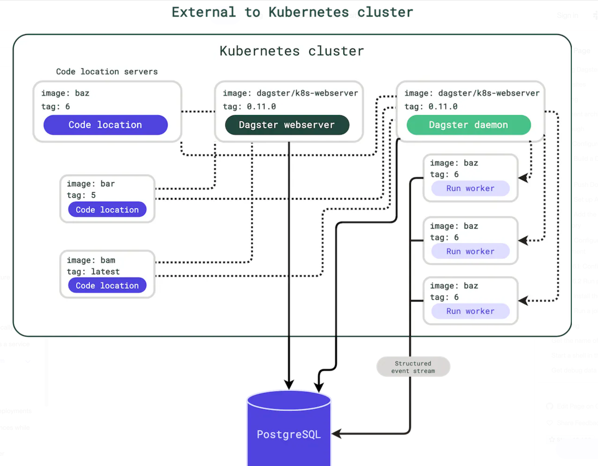

## Deploy Dagster on GKE with Helm

### Architecture


Components of Dagster :

- Web server
- Code server
- Daemon
- worker
- Executor
- Database

### Connect cluster

### Build a Docker image for user code
Build an image for user code on Google artifact registry
```bash
gcloud builds submit --timeout "2h" --tag asia-east1-docker.pkg.dev/datapool-1806/data-kubernetes-dev/dagster:1.0.0
```

### Helm

- Make sure Helm 3 installed
```bash
brew install helm
```
- add Dagster into helm repo
```bash
helm repo add dagster https://dagster-io.github.io/helm
```
- Configure your user deployment
    - Configure the deployment
    
  
    - Run pod_per_op_job (optional)
  gcloud container clusters get-credentials workflow-orchestrator-poc --zone=asia-east1

helm upgrade --install dagster dagster/dagster -f values.yaml

reference : https://docs.dagster.io/deployment/guides/kubernetes/deploying-with-helm
